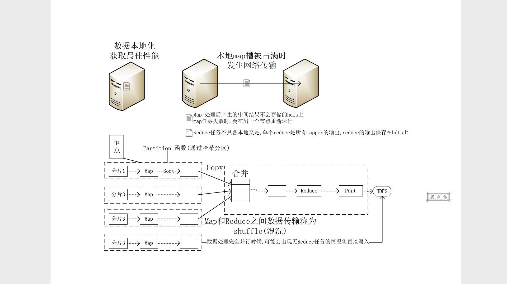

## MapReduceDemo

### 总结
 - CSDN 气象数据找出最高温度

	1.  数据准备阶段
  	- 准备不够充分
  		- 下载了损坏的数据
  			- 不够细心

  2. HadoopApi不够熟悉
  		- 新老api混用导致错误
		  -  hadoop权威一书中有错误导致误导

	3. 打包jar
		- 缺少主类
			-  对jar打包不够熟悉

	4. hadoop的运行方式不了解
  		-  被网络上的各种资料误导

### 打包jar 解决办法
- 引入maven插件
  - maven-shade-plugin

 pom中添加如下XML

```xml
<build>
	<plugins>
		<plugin>
			<groupId>org.apache.maven.plugins</groupId>
			<artifactId>maven-shade-plugin</artifactId>
			<version>2.3</version>
				<executions>
					<execution>
						<phase>package</phase>
							<goals>
								<goal>shade</goal>
							</goals>
								<configuration>
									<transformers>
										<transformerimplementation="org.apache.maven.plugins.shade.resource.ManifestResourceTransformer">
											<mainClass>HadoopDemo.MaxTemperature</mainClass>
										</transformer>
									</transformers>
								</configuration>
					</execution>
				</executions>
		</plugin>
	</plugins>
</build>
```

### Demo

- Mapper

```java
import org.apache.hadoop.io.IntWritable;
import org.apache.hadoop.io.LongWritable;
import org.apache.hadoop.io.Text;
import org.apache.hadoop.mapreduce.Mapper;
import java.io.IOException;
/**
 * 数据筛选,Map阶段
 *  与书中的列子有出入, 不用继承MapReduceBase
 */
public class MaxTemperatureMapper
                //apper<输入键,输入值,输出键,输出值>
        extends  Mapper<LongWritable,Text,Text,IntWritable> {
    private static final int MISSING=9999;
    @Override
    protected void map(LongWritable key, Text value, Context context) throws IOException, InterruptedException {
        //一行数据
        String line=value.toString();
        //获取年份
        String year=line.substring(15,19);
        //
        int airTemperature;
        if(line.charAt(87)=='+'){
            airTemperature=Integer.parseInt(line.substring(88,92));
        }else{
            airTemperature=Integer.parseInt(line.substring(87,92));
        }
        String quality=line.substring(92,93);
        if (airTemperature!=MISSING&&quality.matches("[01459]")){
            context.write(new Text(year),new IntWritable(airTemperature));
        }
    }
}
```

- Reduce

```java
import org.apache.hadoop.io.IntWritable;
import org.apache.hadoop.io.Text;
import org.apache.hadoop.mapreduce.Reducer;
import java.io.IOException;
/**
 * Reduce 数据处理阶段
 *
 */
public class MaxTemperatureReduce
        //和Mapper相似
        extends Reducer<Text,IntWritable,Text,IntWritable>{
    @Override
    protected void reduce(Text key, Iterable<IntWritable> values, Context context) throws IOException, InterruptedException {
        //最高温度
        int maxValue=Integer.MIN_VALUE;
        for (IntWritable value:values){
            maxValue=Math.max(maxValue,value.get());
        }
        context.write(key,new IntWritable(maxValue));
    }
}
```

- 调度

```java
import org.apache.hadoop.fs.Path;
import org.apache.hadoop.io.IntWritable;
import org.apache.hadoop.io.Text;
import org.apache.hadoop.mapreduce.Job;
import org.apache.hadoop.mapreduce.lib.input.FileInputFormat;
import org.apache.hadoop.mapreduce.lib.output.FileOutputFormat;
import java.io.IOException;

public class MaxTemperature {
    public static void main(String[] args) {
        if (args.length!=2){
            System.err.println("数据有误");
            //停止运行
            System.exit(-1);
        }
        try {
            //job 指定作业规范
            Job job=new Job();
            job.setJarByClass(MaxTemperature.class);
            job.setJobName("max");
            //输入路径
            FileInputFormat.addInputPath(job,new Path(args[0]));
            //输出路径
            FileOutputFormat.setOutputPath(job,new Path(args[1]));
            //指定map
            job.setMapperClass(MaxTemperatureMapper.class);
            //指定Reduce
            job.setReducerClass(MaxTemperatureReduce.class);
            //指定输出key类型
            job.setOutputKeyClass(Text.class);
            //指定输出value类型
            job.setOutputValueClass(IntWritable.class);

            System.exit(
                    //是否打印控制台日志
                    job.waitForCompletion(true)?0:1);
        } catch (IOException e) {
            e.printStackTrace();
        } catch (InterruptedException e) {
            e.printStackTrace();
        } catch (ClassNotFoundException e) {
            e.printStackTrace();
        }
    }
}

```

- 运行demo

  1. 准备阶段
      - 打jar
      - 发送到hadoop
      - 准备分析的数据

  2. 执行阶段
      - 执行 `hadoop jar xxxx.jar input output`
        - 需要配置hadoop环境
        - output文件夹必须不存在
      - 查看执行结果


### 一些MapReduce概念

- 数据流
  - job(MapReduce)
    - 客户端执行的的工作单元
    - 输入数据,MapReduce程序,配置信息
    - 又分为若干任务
      - map任务/reduce任务
      - 通过YARN调度
      - 一个任务失败,另一个节点重新调度
  - 输入分片
    - 输入数据划分成等长的数据块
      - 为每个数据块构建Map任务
    - 分片默认大小128M
      - 切片越小负载平衡的质量越高
      > 切片过小导致管理分片和构建map任务的时间变长

- 图解

 

> 尽量避免map和reduce任务之间的数据传输


 ### combiner函数
 - 属于优化方案
 - 针对map任务的输出指定一个combiner
 - combiner无法取代Reduce
 - 一般与reduce处理逻辑相同只要在`调度`中
   - `job.setcombinerClass(Reduce.class)`即可
