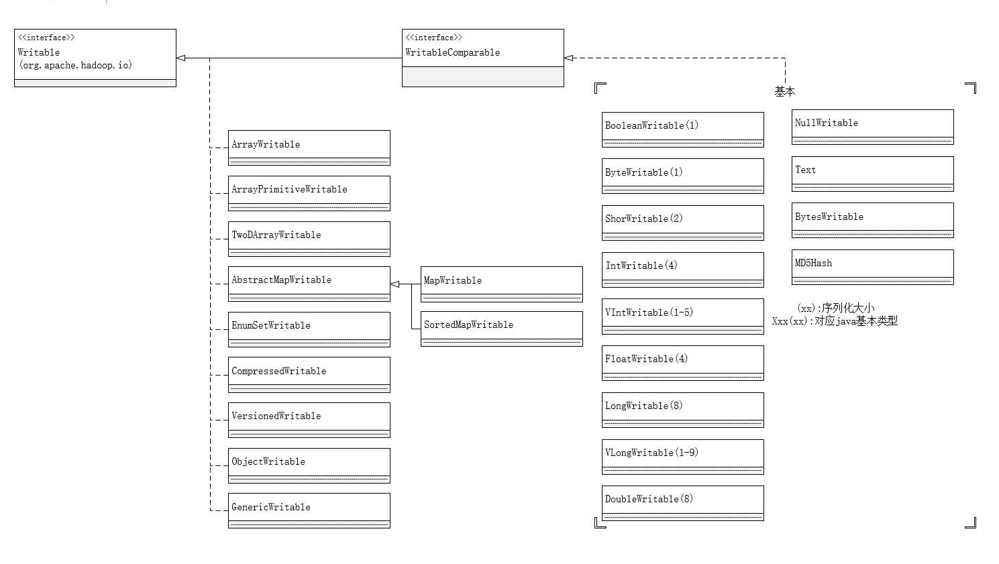

# IO 操作

## HDFS数据完整性
- 会对所有写入数据计算校验和,并在读取数据时验证校验和
  - `dfs.bytes-per-checksum`指定的字节的数据计算校验的和
    - 默认512,有CRC-32校验
- datanode负责收到数据后的存储及其校验和之前数据进行验证
  - 在收取数据,和复制其他datanode数据时执行
  - 在管线中由最后一个datanode负责验证校验和,不符合抛出异常
- 读取数据时,也会验证校验和
  - 与datanode存储的校验和进行比较
  - 每个datanode都会保存一个用于验证的校验和日志
- 定期校验数据块
  - datanode会定期校验本地所有的数据块
    - 损坏时,通过数据副本来修复损坏的数据块
- 使用`FileSystem.setVerifyChecksum(false)` 禁用校验
- 通过`- get -ignoreCrc`命令或者`-copyTolocal`
  - 的可以达到禁用校验和的效果
- `fs -checksum`
  - 来检查一个文件的校验和

- `LocalFileSystem`
  - 执行客户端的校验和验证
  - 禁用和校验
    - 使用`RowLocalFileSystem`对象
  - 全局校验和验证
      - 将`fs.flie.impl`替换为`org.apache.hadoop.fs.RawLocalFileSystem`
      - 新建一个`RowLocalFileSystem`实例
      ```java
        Configurtion conf=...
        FileSystem fs=new RowLocalFileSystem();
        fs.initialize(null,conf);
      ```
- `ChecksumFileSystem`
  - 向无校验和系统中加入校验和
  ```java
  FileSystem rawfs=...
  FileSystem checksummedfd= new ChecksumFileSystem(rawfs);
  ```
  - raw文件系统可以使用 `ChecksumFileSystem.getRawFileSystem()`来获取

## 压缩
1. 减少文件所需要的磁盘控件
2. 加快数据在网络和磁盘上的传输

| 压缩格式 | 工具  | 算法    | 文件扩展名 | 是否可切分 | 是否java实现 | 是否有原生实现 |
| -------- | ----- | ------- | ---------- | ---------- | ------------ | -------------- |
| DEFLATE  | 无    | DEFLATE | .defalate  | 否         | 是           | 是             |
| gzip     | gzip  | DEFLATE | .gz        | 否         | 是           | 是             |
| bzip2    | bzip2 | bzip2   | .bz2       | 是         | 是           | 否             |
| LZO      | lzop  | LZO     | .lzo       | 否         | 否           | 是             |
| LZ4      | 无    | LZ4     | .LZ4       | 否         | 否           | 是             |
| Snappy   | 无    | Snappy  | .snappy    | 否         | 否           | 是             |
> LAZO已经被索引了,那么LZO可以切分
> `io.native.lib.available`为false时,可确保使用内置java代码库

- 压缩工具
  - `-1`: 优化压缩数度
  -  `-9`: 优化压缩空间

- CodecPool
  -压缩池,反复使用时压缩解压缩时,避免创建这种对象的开销

- 压缩和输入分片
  - 不会切分gzip压缩文件(gzip不支持切分),牺牲了数据本地性,一个map处理8个HDFS,任务数减少,作业的粒度减少,运行时间变长
  - 压缩策略
    - 使用容器文件格式(Avro数据文件,ORCFiles或者Parquet) 这些文件同时支持压缩和切分,通常最好与一个快速压缩工具配合使用
      - LZO,LZ4,Snappy
    - 使用支持切分的压缩格式
      - bzip2
      - 通过索引实现切分的LZO
    - 在应用中将文件切分成块
      - 使用任意一种压缩工具
      - 需要合理选择数据块大小
    - 存储未经压缩的文件
    - > 大文件不要使用不支持切分的压缩格式,不然导致MapReduce效率底下

- MapReduce中使用压缩
  - `mapreduce.output.fileoutputformat.compress`
    - 是否使用压缩
    - 默认:`false`
    - `FileOutputFormat.setCompressOutput(job,true);`
  - `mapreduce.output.fileoutputformat.Compress.codec`
    - 使用压缩的类
    - 默认: `DefautCodec`
    - `FileOutputFormat.setOutputCompressorClass(job, GzipCodec.class);`
 - 序列文件
 - `mapreduce.output.fileOutputformat.compress.type`
   - 控制压缩所使用的格式
   - 默认:`RECORD`
     - 针对每条记录进行压缩
   - `BlOCK`
     - 针对一组数据压缩
       - 推荐
       - `SequenceFileOutputFormat.setOutputCompressionType(job, SequenceFile.CompressionType.BLOCK); `
- map中任务中使用压缩
  - `mapreduce.map.output.compress`
    - 对map任务输出进行压缩
    - 默认:`false`
    - `org.apache.hadoop.conf.Configuration.setBoolean(Job.MAP_OUTPUT_COMPRESS,true);`
  - `mapreduce.map.output.commress.codec`
    - 所使用的压缩类
    - 默认: `DefaultCodec`
    - `org.apache.hadoop.conf.Configuration.setClass(Job.MAP_OUTPUT_COMPRESS_CODEC,GzipCodec.class, CompressionCodec.class);`

## 序列化
- 序列化
  - 实质结构化的对象转化为字节流以便在网络上传输或写到磁盘进行永久存储的过程
- 反序列化
  - 字节流转回结构化对象的逆过程
- 应用领域
  - 进程间通信
  - 永久存储
- RPC
  - 远程过程调用
  - RPC序列化格式如下
    - 紧凑
      - 从发充分利用网络宽带
    - 快速
      - 进程间通信形成分布式系统的骨架
        - 需要尽量减少序列化和反序列化带来的开销
    - 可扩展
      - 为了满足新的需求,协议不断变化
    - 支持互操作
      - 以不同的语言读写数据

### `writable`
- hadoop的序列化格式
- 紧凑快速,不太容易被其他语言所扩展

- `writable接口`
  - `void write(DataOutpur out) throw IOException`
    - 将状态写入二进制流
  - `void readFields(DataInput in) throw IOException`
    - 二进制流中读入状态

- 相关例子参照
  - hadoop-demo中的writable-demo

- `RawComparator`
  - 优化接口继承于`java.lang.Comparable`
  - 该接口允许其实现直接比较数据流中的记录,无须反序列化
    - 降低了新建对象的额外开销

- `WritableComparable`
  - 继承自`java.lang.Comparable`,`Writable`接口
  - 对MapReduce来说类型很重要,中间有个基于键的排序
  - 是RawComparator的通用实现
    - 提供原始`compare()`方法的比较
    - 充当`RawComparator`的实例工厂
  - 实例
    -  hadoop-demo中的writable-demo中test2的测试方法

#### `Writable 继承结构`



- `Writable`类对所有的java基本类型进行封装
  - 提供`get()`,`set()`方法用于读取和存放
- 定长格式(IntWritable,LongWritable)和变长格式(VIntWritable,VLongWritable)
  - 变长格式
    - `-127`-`+127`,只用一个字节进行编码
      - 不在次范围内时,第一个字节表示数值的正负和后跟多少个字节
  - 如何选择
    - 变长更节省空间,能方便的在VIntWritable和VlongWritable之间转换
- `Text`
  - 针对UTF-8序列的writable类
  - 相当于`java.lang.String`
  - 最大值为2GB
  - 索引
    - 是根据编码后的字节序列中的位置实现的,并非Unicode字符
    - 对于ASCII字符串三个概念是一直的
    - `getLength()`方法返回的是UTF-8变法的字节数
    - `find()`方法返回的是偏移量
    - 与`java.lang.String`对比实例
      -  hadoop-demo中的writable-demo中test3的测试方法
  - 迭代
    - 利用字节偏移量实现的位置索引
    - 实例
      -  hadoop-demo中的writable-demo中test4的测试方法
  - 可变性
- `BytesWritable`
  - 针对二进制数组的封装
  - 序列化格式为:一个指定所含数据字节数的整数域(4字节),后跟数据内容
- `NullWritable`
  - 是`wrotable`的特殊类型
  - 序列化长度为0,不会读入或写出数据
  - 充当占位符
  - 不可变的单实例类型
- `ObjectWritable`
  - 是对java基本类型(String,enum,writable,null,或这些类型数组)的通用封装
- `GenericWritable`
  - 封装的类型数量比较少并且能够提前知道,那么可通过使用静态类型的数组
  - 序列化后的类型的引用加入位置索引来提高性能
  - 在继承的子类中指定泛型
- 集合类
  - `ArrayWritable`,`ArrayPrimitveWritable`,`TwoDArrayWritable`,`MapWritable`,`SortedMapWritable`,`EnumMapTiable`
  - `ArrayWritable`,`TwoDArrayWritable`
    - 针对数组和二维数组的实现
    - 所有元素必须是同以类型的
    - 一边作为MapReduce的输入
    - `toArray()`方法属于`浅层拷贝`
  - `ArrayPrimitveWritable`
    - 对java基本数组类型的一个封装
    - 可以识别相应组件类型,无需通过继承该类来设置类型
  - `MapWritable`和`SortedMapWritable`
    - 分别实现了java的Map和SortMap
    - 每个键/值使用的类型是相应字段序列化形式的一部分
      - 类型存储为单个字节(充当类型数组的索引)
- 实现定制的Writable集合
  - 实例
    - hadoopdemo中custom-writable-collection
  - 注意事项
    - 提供默认构造函数
      - Mapreduce框架可以进行实例化
    - `hashCode()`
      - Hashpartitioner通常用hashCode方法来选择reduce分区

## 序列化框架
- MapRecuce可以使用任何类型
  - 只要能有一种机制对每个类型与二进制表示的来回转换就可以
- 为了支持这一机制,Hadoop有一个针对可替换序列化框架(serialization frameword)Api
- 序列化框架由`Serialization`实现
  - `Serrializer`
    - 对象转换为字节流
  - `Deserializer`
    - 字节流转换为对象
- 注册`Serialization`
  - 将io.serizalizations属性设置为一个有逗号分隔的类名列表
  - 默认实现
    -  `org.apache.hadoop.io.serializer.WritableSerialization`
    - Avro指定序列化及Reflect(自反)序列化类
      - 基于IDL的序列化序列化框架
        - 适用大规模数据处理
- `WritableSerialization`
  - 是对writable类型的Serialization实现
- `JavaSerialization`
  - 该类使用javaObjSerialization
    - 方便使用标准java类型
    - 不如Writable高效

- 序列化IDL
  - 不通过代码来定义类型,而是有使用接口定义语言以不依赖具体语言的方式进行声明,由此,系统能为其他语言生成类型
  - 有效提高互操作能力
  - 常用序列化框架
    - `Apche Thirt`,`Protocol Bufifers`
    - 常常用作二进制数据的永久存储格式
    - MapReduce支持有限,Hadoop部分组件使用上述两个序列化框架与RPC和数据交换

## SequenceFile
- 纯文本不适合记录二进制类型的数据
  - `SequenceFile`类非常合适
- 为二进制键值对提供了一个持久数据结构
- 可以作为小文件的容器
  - Hdfs,Mapreduce是针对大文件优化的,通过SequenceFile类型将小文件包装起来,可以获取高效率的存储和处理
