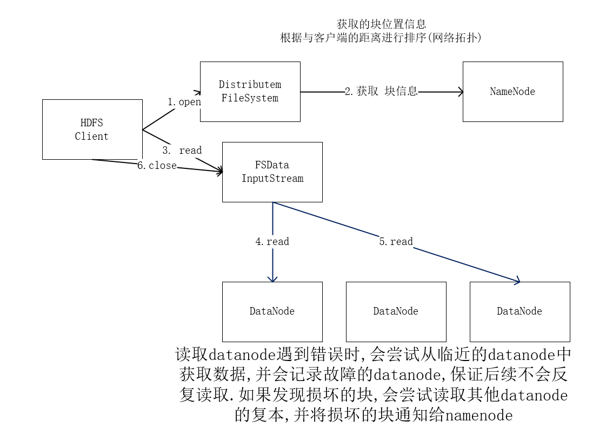
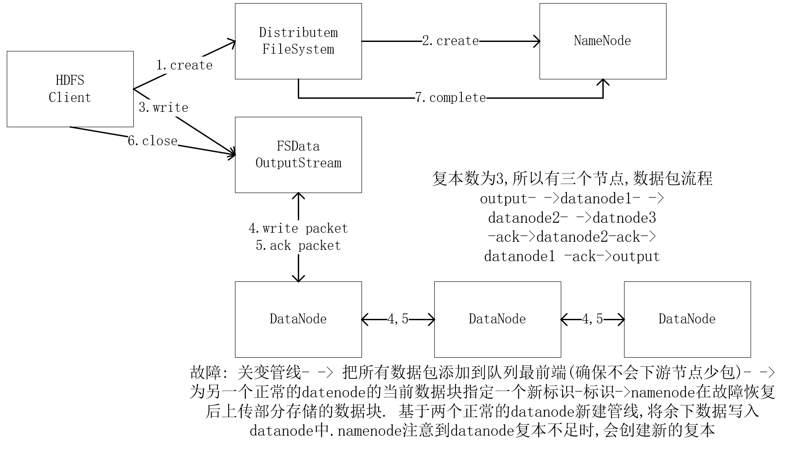

# hadoop 输入输出文件系统
## 读取


> 网络拓扑需要额外的配置

## 写入



## 一致模型
- 创建文件之后
  - 文件系统中立即可见
- 写入文件内容
  - 不保证能立即可见
  - 超过一个块后第一个块可见
    - 正在写入的块为不可见

- `FsDateOutputSteam.hflush()`
  - 保证到目前为止写入的数据可见
  - >不保证数据到磁盘上,仅确保数据在datanode的内存上
- `FsDateOutputSteam.hsync()`
  - 确保数据写到磁盘上
  - 利用java api 写入本地文件
  - 刷新数据流且可同步之后看到的内容

> 注意调用频率

## distcp并行 复制
- `Distcp`一种用法是替代 `hadoop fs -cp`
-  `hadoop distcp f1 f2`
  - f1,f2 可以为目录也可以为文件
  - 2,不存在时,新建2目录,将1目录下的文件复制到2目录
  - 2,已经存在时,将1目录复制到2目录下, 列:`2/1`
- `-overwrite`
  - 保持同样的目录
- `-update`
  - 仅更新发生变化的文件
- `-m `
  - 来指定map数量
- 不同的版本的集群
  -  `webhdfs`来复制

> 虚拟机跑巨慢 多给点资源 限制map数量 否则超级慢

```blog
{type: "Hadoop", tag:"大数据,Hadoop,java",title:"输入输出剖析"}
```
